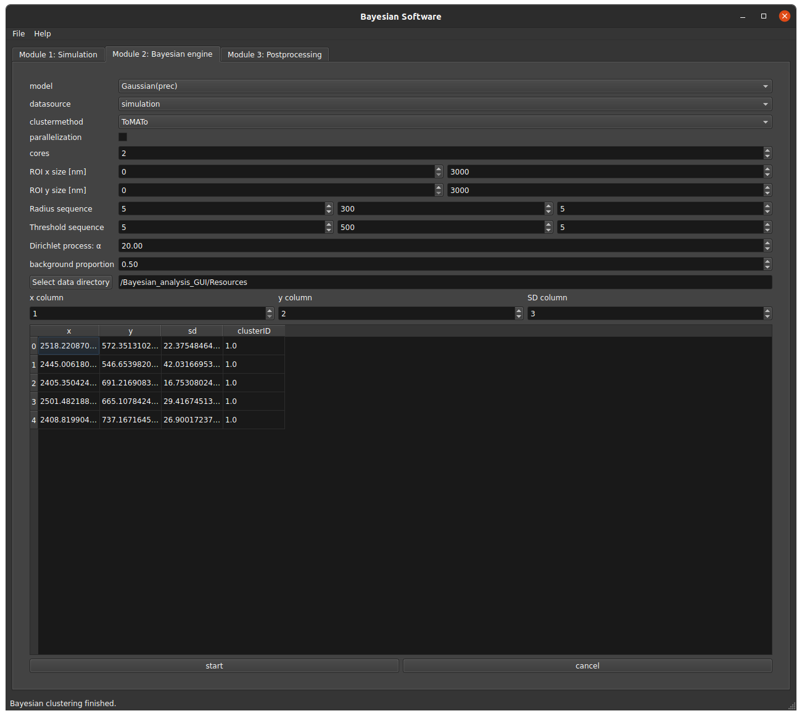

# BaClAva

## About the Bayesian software BaClAva:

Bayesian software BaClAva (Bayesian Cluster Analysis and Visualisation Application) is a software tool with a graphic
user interface for the analysis of clustering in data from single-molecule localization microscopy (SMLM). It uses a
Bayesian engine for user-independent investigation of spatial distributions based on the code published in
Rubin-Delaunchy et al. [[1]](#1) and includes a number of clustering algorithms published therein and in [[2]](#2). This
tool offers the option to generate artificial ground-truth data, to analyze the spatial distribution localizations with
a Bayesian model to determine the degree of clustering and other quantitative measures of nonrandom distribution. It
offers batch processing of several experiments, and the fast turnover of data taken from a large field of view. Our
software delivers clustering analysis with actively minimized user bias and significantly accelerated computation.

## Table of content:

- [Installation](#Installation)
    - [Developer installation](#Developer-installation)
- [Software overview](#Software-overview)
    - [Module 1: Simulation tool](#Module-1-Simulation-tools)
    - [Module 2: Bayesian calculations](#Module-2-Bayesian-calculations)
    - [Module 3: Bayesian postprocessing](#Module-3-Bayesian-postprocessing)
    - [Data format](#Data-format)
- [Usage](#Usage)
- [Contributing](#Contributing)
- [Acknowledgement](#Acknowledgment)
- [Citing BaClAva](#Citing-BaClAva)
- [Literature](#Literature)
- [Licencing](#Licencing)

# Installation:

## Developer installation

### Requirements

In order to use BaClAva, Python 3.8 and R 4.1.0 need to be installed. Furthermore, we recommend installing Anaconda as a
package manager and PyCharm as the IDE because it can handle Python and R code.

### Environment

If you use PyCharm, follow the VCS (Version Control System) path to install BaClAva directly from GitHub and create a
Python environment. An Anaconda environment can be created via `conda create --name baclava_environment`
where `baclava_environment` can be your preferred name. Afterwards, start your environment
via `conda activate baclava_environment`.

Install all packages in the `requirements.txt` via `pip install -r requirements.txt`. If you use PyCharm, the IDE
automatically to install all packages and choose a conda environment, you need to install `rpy2`
via `pip install rpy2` because it is currently not part of Anaconda.

If you work on a **Linux** machine, it might be that you need to install the C++ engine
for [V8](https://ropensci.org/blog/2020/11/12/installing-v8/) separately.

**Windows** users need to have [Rtools40](https://cran.r-project.org/bin/windows/Rtools/) installed for proper
installation of the `RSMLM` package.

The R packages used in this software are from CRAN, Bioconductor, and GitHub repositories. Running the
file `packages_list.R` installs all R packages. The package for the hdf5 handling might not raise an error during
installation. Therefore, install `BiocManager (install.packages("BiocManager")`
and `rhdf5 BiocManager::install("rhdf5")` by hand. If any other packages raise an error message, check out the error
messages and install them individually.

# Software overview:

The software offers three analysis modules integrated into a single GUI. The first module allows simulating datasets.
The second module processes these simulated datasets or experimentally acquired SMLM. This module starts by calculating
the cluster inclusion of each single-molecule localization and provides Bayesian scores for a wide parameter space. The
Bayesian analysis of parameter values assists the user in applying unbiased clustering analysis to their data. Parallel
computation can decrease the processing time of batches of datasets. The final module performs calculations based on
these parameters and generates quantitative output for several essential characteristics of clusters, i.e., the cluster
area or density. For ease of use, each module can also be used independently.

## Module 1: Simulation tools

The first module of the Bayesian software, the simulation tool, enables the user to simulate simple Gaussian-like
clusters. This module has two parts depending on the output the user would like to get. Module 1a simulates the single
localisations, and Module 1b enables the user to simulate blinking fluorophores.

Upon starting the simulation module 1a, the user is prompted to adjust several simulation parameters, the number of
datasets, and the storage directory. The user can only start the simulation process after choosing a proper directory.
The tool simulates the final localisations assuming that each molecule is represented by a single localization. For each
simulation, the final table of localisations with the 2D coordinates ('x', 'y'), the localization's standard deviation (
' sd') and its label ('clusterID') are stored as a dataset ('data') in a hdf5 file.

In module 1b, the GUI prompts the user to adjust the parameters for the simulation of the underlying molecule
distribution, the fluorophores' blinking and the camera parameters, and the storage directory. The user needs to select
a storage directory to start the simulation process. This module simulates the SMLM-like behavior of blinking dyes and
stores the results in tiff files. In order to continue module 2, the output files need to be localized by algorithms
such as SMAP[[3]](#3) or Thunderstorm [[4]](#4).

In order to generate simulations of blinking fluorophores in clusters that best resemble the data imaged on the
microscope. Therefore, we advise the user to image the PSF and intensity of the dye of interest.

## Module 2: Bayesian calculations

The clustering of either simulated or experimental data takes place in the second module. The input data for this module
must be a localization table of the appropriate format. For experimental data and simulations run in other programs,
this table can come from any common localization application ( e.g., SMAP [[3]](#3) or Thunderstorm [[4]](#4)). The
resulting table needs to contain the 2D coordinates and standard deviations of the localizations. The software can read
data from CSV and text files. However, the program copies the data to a hdf5 file for further use.

In the GUI, the user can choose their preferred clustering algorithm (Ripley's-K-based clustering, DBSCAN,
ToMATo [[2]](#2)) and other parameters. The radius and threshold sequences and their step width are essential because
they determine the Bayesian engine's parameter space. Note here that it has been shown that Ripley's-K-based clustering
and DBSCAN clustering are more sensitive to parameter selection compared to ToMATo [[2]](#2). Instead of choosing single
datasets for the analysis, the user chooses an entire dataset folder by picking a random dataset within this folder. The
GUI then helps the user select the correct columns for the analysis by displaying the selected dataset's top part. The
program loops through the given radius and threshold sequences after the user presses the start button. For each set of
parameters, the program clusters the localisations and assigns a (cluster) label to each localization. Then, the
software scores each calculated cluster result against a Gaussian model. The scores ('r_vs_thresh') and labels are
stored in the hdf5 file along with the dataset information.

On Unix systems (any Linux or OS distribution) with multiple cores, the processing time can be improved by parallelizing
the clustering calculations. Note here that this option is not available on Windows machines right now.

## Module 3: Bayesian postprocessing

In the third module of this software for Bayesian clustering, various clustering parameters, e.i. the area of the
clusters or their density, are calculated for the best cluster parameter set. This application can analyze an entire
folder of datasets with the same experimental conditions and therefore may offer histograms summarising the respective
condition. The GUI displays the clustered localisations of a random dataset in the folder as a scatter plot and
histograms for the different cluster parameters. The software automatically stores the data for these plots in the hdf5
file. However, the user must tell the software whether to automatically create and store the corresponding scatterplots
and histograms as png, eps, and pdf files. Since the GUI displays the plotted data and allows for their formatting, the
user also can save the plots individually.

## Data format

The Bayesian software uses the hdf5 file format to manage and store the datasets and the data gathered during the
Bayesian analysis. Each dataset has all its information stored in a single file, keeping the number of stored files to a
minimum while keeping the “raw” localizations unchanged. Later access to the data in the hdf5 file is possible with any
standard hdf5 library. The following part will explain the file structure for users interested in accessing the file
with other software tools.

The localization table is stored in `data`, and the column names are stored as its attribute `colnames`. The labels for
the different parameter combinations are stored in the `label`-group. The scores of the Bayesian analysis are stored in
a matrix called `r_vs_thresh`. The columns are the radius sequence, and the rows are the threshold sequence. In the hdf5
file, these names are stored as attributes to the `r_vs_thresh` dataset. The parameter set of the best cluster result
within the chosen parameter space is another attribute to this dataset called `best`.

The simulation of SMLM-like data mimics actual microscopy experimental acquisition. The data is stored either as a
tiff-stack or in a folder with individual tiff files for each frame. The tiff specifications are the same as for EMCCD
cameras, and it is possible to load the data into ImageJ or SMAP for further processing.

The selected parameters for simulations and the Bayesian analysis are the same for the entire folder. Thus, the software
stores the information in two separate files `sim_parameters.txt` or `sim_smlm_parameters`, depending on the selected
simulation option, and `run_config.txt`, respectively. For a new analysis without losing the information of the previous
analysis, the folder should be duplicated.

The final histograms are stored in a separate folder named `postprocessing`.

# Usage

## Preparation

For simulation work, there is no preparation necessary.

When working with microscopy or module 1b data, the localisation files should be in one or more folders without any
additional files. Otherwise, BaClAva might show you an error message.

## Starting BaClAva

You can use BaClAva via your terminal or your preferred IDE. In either case, you first need to make sure that you have
the correct python environment activated. You can start your python environment by
writing `conda activate baclava_environment` when Anaconda is installed on your computer. Then,
start `Bayesian_software.py` from the IDE or type `python Bayesian_software.py` in the terminal. A GUI interface with a
tab for each module will pop up on your screen.

Go to the tab of your choice, choose your parameters and press start. The status bar will indicate the state of your
operation. Keep in mind, that none of the modules will work without a storage directory.

# Contributing

For feature requests or bug reports, please post them on the GitHub issue tracker.

# Citing BaClAva

If you use BaClAva in your research, please cite the pre-print:

An efficient GUI-based clustering software for simulation and Bayesian cluster analysis of single-molecule localization
microscopy data 
Saskia Kutz, Ando C. Zehrer, Roman Svetlitckii, Gülce S. Gülcüler Balta, Lucrezia Galli, Susanne Kleber, Ana
Martin-Villalba, Helge Ewers 
bioRxiv 2021.06.11.447933; doi: https://doi.org/10.1101/2021.06.11.447933

# Literature:

<a id='1'>[1]<a/>
Rubin-Delanchy, P., Burn, G., Griffié, J. et al. Bayesian cluster identification in single-molecule localization
microscopy data. Nat Methods 12, 1072–1076 (2015). https://doi.org/10.1038/nmeth.3612

<a id='2'>[2]<a/>
Jeremy A Pike, Abdullah O Khan, Chiara Pallini, Steven G Thomas, Markus Mund, Jonas Ries, Natalie S Poulter, Iain B
Styles, Topological data analysis quantifies biological nano-structure from single molecule localization microscopy,
Bioinformatics, Volume 36, Issue 5, March 2020, Pages 1614–1621, https://doi.org/10.1093/bioinformatics/btz788

<a id='3'>[3]<a/>
Ries, J. SMAP: a modular super-resolution microscopy analysis platform for SMLM data. Nat Methods 17, 870–872 (2020)
. https://doi.org/10.1038/s41592-020-0938-1

<a id='4'>[4]<a/>
Martin Ovesný, Pavel Křížek, Josef Borkovec, Zdeněk Švindrych, Guy M. Hagen, ThunderSTORM: a comprehensive ImageJ
plug-in for PALM and STORM data analysis and super-resolution imaging, Bioinformatics, Volume 30, Issue 16, 15 August
2014, Pages 2389–2390, https://doi.org/10.1093/bioinformatics/btu202

# Licencing:

This project is licensed under the MIT License - see the LICENSE.md file for details
